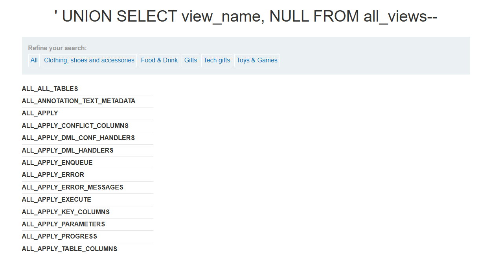

# SQL injection attack, querying the database type and version on Oracle

## 문제 조건

이 실습의 **상품 카테고리 필터에는 SQL injection 취약점**이 존재한다. `UNION` 공격을 통해 삽입한 쿼리의 결과를 조회할 수 있으며, 이를 이용해 **데이터베이스의 버전 문자열을 화면에 표시**해야 한다.

- **취약점 위치:** 상품 카테고리 필터.
- **데이터베이스 종류:** Oracle.
- **사용 가능한 공격 방식:** `UNION`을 이용해 삽입한 쿼리의 조회 결과를 가져올 수 있다.
- **해결 조건:** 데이터베이스 버전 문자열을 화면에 표시한다.
- **직접 확인할 사항:** 원래 쿼리의 반환 열 개수와 각 열의 자료형, 결과가 화면에 표시되는 위치 등은 탐색 과정에서 확인한다.

> [!info] 문제에서 주어진 정보
> 위 내용은 공식 문제 설명과 제목을 기준으로 정리했다. 실제 요청, 시도한 입력값과 관찰 결과는 탐색 과정에 기록한다.

## 탐색 과정

### 1. 항상 참인 조건으로 SQL injection 확인 및 다음 공격 방향 구상

먼저 상품 카테고리 필터에 다음과 같이 입력하여 SQL injection 취약점이 있음을 확인했다.

```text
filter?category=' OR 1=1 --
```

**관찰과 판단**

조회한 정보가 화면에 표 형태로 표시되는 것을 관찰했다. 이를 보고, `UNION SELECT`로 다른 조회 결과를 기존 결과에 결합하면 그 정보도 화면에 표시할 수 있을 가능성이 있겠다고 생각했다.

**다음 시도 방향**

`UNION SELECT` 계열 공격을 시도해 보기로 했다. 이 단계에서는 공격 가능성을 구상한 것이며, 실제 `UNION` 쿼리의 성공 여부와 반환 열 개수·자료형은 아직 확인하지 않았다.

### 2. `ORDER BY`로 반환 열 개수 탐색

반환 열 개수를 알아보기 위해 상품 카테고리 필터에 다음 입력값을 순서대로 시도했다.

```sql
' ORDER BY 1 --
' ORDER BY 2 --
' ORDER BY 3 --
```

**관찰 결과**

세 번째 입력값인 `' ORDER BY 3 --`을 시도했을 때 화면에 `Internal Server Error`가 표시되었다.

### 3. `UNION SELECT`로 뷰 이름 조회 성공

다음 입력값을 상품 카테고리 필터에 넣어 뷰 이름 조회를 시도했다.

```sql
' UNION SELECT view_name, NULL FROM all_views--
```

**관찰 결과**

뷰 이름을 얻는 데 성공했다. 화면에 `ALL_ALL_TABLES`, `ALL_ANNOTATION_TEXT_METADATA`, `ALL_APPLY` 등의 뷰 이름이 표시되었다.



## 해결 과정

## 배운 점

-

## 참고

- [PortSwigger 원본 실습](https://portswigger.net/web-security/sql-injection/examining-the-database/lab-querying-database-version-oracle)
