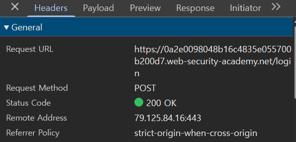
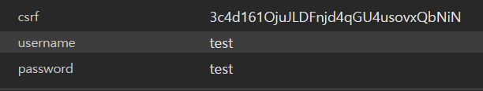

# SQL injection vulnerability allowing login bypass

## 문제 조건

이 실습의 **로그인 기능에는 SQL injection 취약점**이 존재한다. 이를 이용해 애플리케이션에 `administrator` 사용자로 로그인해야 한다.

- **취약점 위치:** 로그인 기능.
- **목표 계정:** `administrator`.
- **해결 조건:** SQL injection으로 인증을 우회하여 해당 계정으로 로그인한다.
- **제공되지 않은 정보:** 실제 로그인 처리 SQL과 데이터베이스 종류는 문제 설명에 명시되어 있지 않다.

> [!info] 문제에서 주어진 정보
> 위 내용은 공식 문제 설명에서 제공한 조건이다. 직접 관찰한 요청과 응답, 시도한 입력 및 결과는 탐색 과정에 기록한다.

## 탐색 과정

### 1. 기본 로그인 시도 및 요청 확인

먼저 사용자 이름과 비밀번호에 각각 `test`를 입력하여 로그인을 시도하고, 개발자 도구에서 로그인 요청을 확인했다.

- **요청 경로:** `/login`
- **요청 메서드:** `POST`
- **전송 항목:** `csrf`, `username`, `password`
- **입력값:** `username=test`, `password=test`
- **HTTP 응답 상태:** `200 OK`
- **화면에 표시된 결과:** `Invalid username or password.`

HTTP 응답은 `200 OK`였지만, 화면에는 `Invalid username or password.`가 표시되어 로그인에 실패했다.

**로그인 요청 헤더**

**로그인 요청의 전송 데이터**

## 해결 과정

## 배운 점

-

## 참고

- [PortSwigger 원본 실습](https://portswigger.net/web-security/sql-injection/lab-login-bypass)
