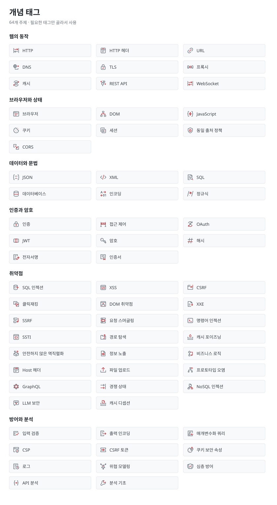

# 개념 태그

개념 노트에 사용할 SVG 아이콘 태그 64종을 준비했습니다. 기존 주제 아이콘 31종과 새 기반 지식·방어 아이콘 33종을 함께 사용합니다.



## 사용하기

개념 노트의 맨 위 메타데이터에 필요한 태그만 적습니다. 한 글에 여러 개를 달 수 있습니다.

```yaml
tags:
  - HTTP
  - 쿠키
  - 세션
```

등록된 이름·ID·별칭을 모두 인식합니다. 예를 들어 `cookie`와 `쿠키`는 같은 태그로 표시됩니다. 태그를 클릭하면 같은 태그가 붙은 개념 글로 이동합니다.

`tags: []` 또는 생략한 경우 태그 영역이 생기지 않습니다. 목록에 없는 이름도 `#` 표시가 붙은 텍스트 태그로 사용할 수 있습니다. 기존 풀이 노트에는 태그를 자동으로 달지 않으며, 글 끝의 **관련 개념** 링크는 계속 직접 작성합니다.

[개념 노트 템플릿](../content/templates/concept.md)은 사이트에 글로 발행되지 않습니다. 실제로 작성할 때 `content/` 안의 원하는 폴더로 복사하세요.

## 준비된 태그

### 웹의 동작

| 태그 이름 | ID | 함께 인식하는 표기 |
| --- | --- | --- |
| HTTP | `http` | `요청과 응답` |
| HTTP 헤더 | `http-headers` | `headers`, `헤더` |
| URL | `url` | `URI`, `주소` |
| DNS | `dns` | `도메인 이름 시스템` |
| TLS | `tls` | `HTTPS`, `SSL` |
| 프록시 | `proxy` | `reverse proxy`, `리버스 프록시` |
| 캐시 | `caching` | `cache`, `HTTP 캐시` |
| REST API | `rest-api` | `REST`, `RESTful` |
| WebSocket | `websockets` | `웹소켓` |

### 브라우저와 상태

| 태그 이름 | ID | 함께 인식하는 표기 |
| --- | --- | --- |
| 브라우저 | `browser` | `웹 브라우저` |
| DOM | `dom` | `문서 객체 모델` |
| JavaScript | `javascript` | `JS`, `자바스크립트` |
| 쿠키 | `cookies` | `cookie` |
| 세션 | `sessions` | `session` |
| 동일 출처 정책 | `same-origin-policy` | `SOP`, `same origin` |
| CORS | `cross-origin-resource-sharing-cors` | `교차 출처 리소스 공유` |

### 데이터와 문법

| 태그 이름 | ID | 함께 인식하는 표기 |
| --- | --- | --- |
| JSON | `json` | — |
| XML | `xml` | — |
| SQL | `sql` | `구조화 질의 언어` |
| 데이터베이스 | `database` | `DB`, `데이터베이스 구조` |
| 인코딩 | `encoding` | `decoding`, `디코딩`, `Base64` |
| 정규식 | `regex` | `regular expression`, `정규 표현식` |

### 인증과 암호

| 태그 이름 | ID | 함께 인식하는 표기 |
| --- | --- | --- |
| 인증 | `authentication` | `login`, `로그인` |
| 접근 제어 | `access-control-vulnerabilities` | `authorization`, `인가`, `access control` |
| OAuth | `oauth-authentication` | `oauth2`, `OAuth 인증` |
| JWT | `jwt` | `JSON Web Token` |
| 암호 | `cryptography` | `encryption`, `암호화` |
| 해시 | `hashing` | `hash`, `해싱` |
| 전자서명 | `digital-signatures` | `digital signature`, `디지털 서명` |
| 인증서 | `certificates` | `certificate`, `X.509` |

### 취약점

| 태그 이름 | ID | 함께 인식하는 표기 |
| --- | --- | --- |
| SQL 인젝션 | `sql-injection` | `SQLi`, `SQL injection` |
| XSS | `cross-site-scripting` | `크로스 사이트 스크립팅`, `cross site scripting` |
| CSRF | `cross-site-request-forgery-csrf` | `크로스 사이트 요청 위조` |
| 클릭재킹 | `clickjacking` | `UI redressing` |
| DOM 취약점 | `dom-based-vulnerabilities` | `DOM 기반 취약점` |
| XXE | `xml-external-entity-xxe-injection` | `XML 외부 엔티티` |
| SSRF | `server-side-request-forgery-ssrf` | `서버 측 요청 위조` |
| 요청 스머글링 | `http-request-smuggling` | `HTTP request smuggling`, `HTTP desync` |
| 명령어 인젝션 | `os-command-injection` | `command injection`, `OS 명령어 인젝션` |
| SSTI | `server-side-template-injection` | `서버 측 템플릿 인젝션` |
| 경로 탐색 | `path-traversal` | `directory traversal`, `디렉터리 탐색` |
| 캐시 포이즈닝 | `web-cache-poisoning` | `web cache poisoning`, `캐시 오염` |
| 안전하지 않은 역직렬화 | `insecure-deserialization` | `deserialization`, `역직렬화` |
| 정보 노출 | `information-disclosure` | `정보 유출` |
| 비즈니스 로직 | `business-logic-vulnerabilities` | `business logic`, `논리 취약점` |
| Host 헤더 | `http-host-header-attacks` | `HTTP Host`, `호스트 헤더` |
| 파일 업로드 | `file-upload-vulnerabilities` | `file upload` |
| 프로토타입 오염 | `prototype-pollution` | `prototype pollution` |
| GraphQL | `graphql-api-vulnerabilities` | `GraphQL API` |
| 경쟁 상태 | `race-conditions` | `race condition` |
| NoSQL 인젝션 | `nosql-injection` | `NoSQL injection` |
| LLM 보안 | `web-llm-attacks` | `프롬프트 인젝션`, `prompt injection` |
| 캐시 디셉션 | `web-cache-deception` | `web cache deception`, `캐시 기만` |

### 방어와 분석

| 태그 이름 | ID | 함께 인식하는 표기 |
| --- | --- | --- |
| 입력 검증 | `input-validation` | `input validation` |
| 출력 인코딩 | `output-encoding` | `output encoding`, `escaping`, `이스케이프` |
| 매개변수화 쿼리 | `prepared-statements` | `prepared statement`, `parameterized query`, `준비된 문장` |
| CSP | `content-security-policy` | `콘텐츠 보안 정책` |
| CSRF 토큰 | `csrf-tokens` | `CSRF token` |
| 쿠키 보안 속성 | `secure-cookies` | `HttpOnly`, `SameSite`, `Secure 쿠키` |
| 로그 | `logging` | `log`, `로깅` |
| 위협 모델링 | `threat-modeling` | `threat modeling` |
| 심층 방어 | `defense-in-depth` | `defense in depth`, `다층 방어` |
| API 분석 | `api-testing` | `API testing`, `API 테스트` |
| 분석 기초 | `essential-skills` | `보안 분석`, `기초 도구` |

## 에셋 관리

- [태그 목록](../site/concept-tags.json)에 표시 이름, 별칭, SVG 경로를 한 번만 등록합니다.
- [새 개념 SVG](../site/assets/icons/concepts/)와 [기존 주제 SVG](../site/assets/icons/topics/)는 24×24 벡터입니다.
- 기존 태그 ID는 링크 주소에 쓰이므로 유지하고, 이름 변경은 `label`과 `aliases`로 처리합니다.
- 목록이나 SVG를 수정했다면 저장소 루트에서 `node scripts/generate-concept-tag-sheet.mjs`를 실행해 이 안내와 미리보기를 갱신합니다.
